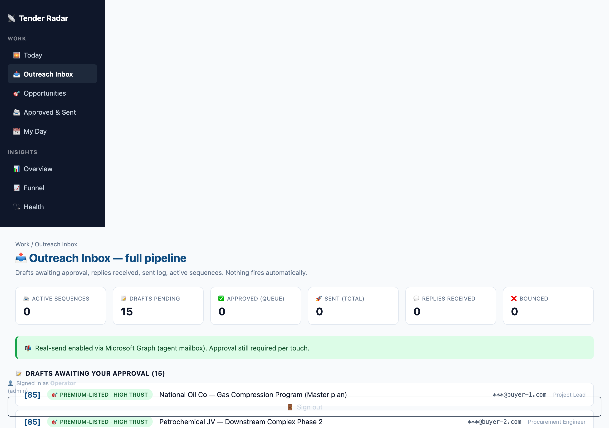
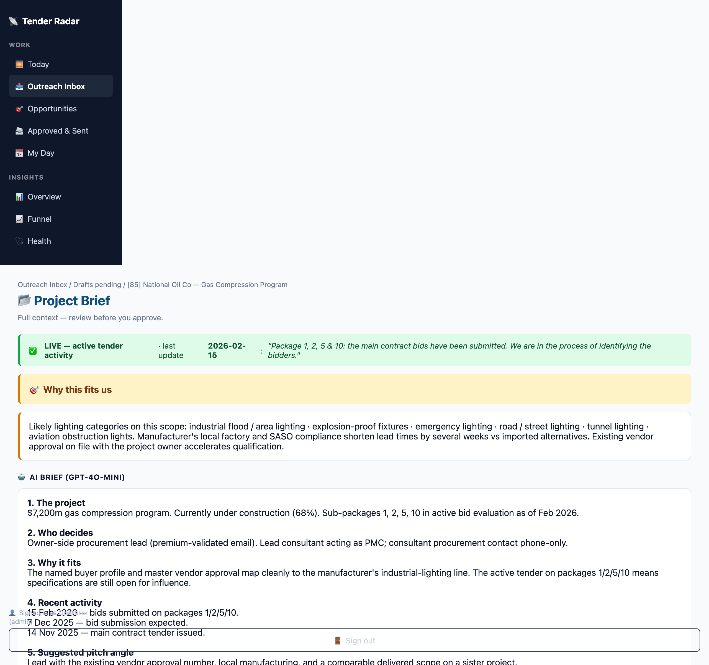
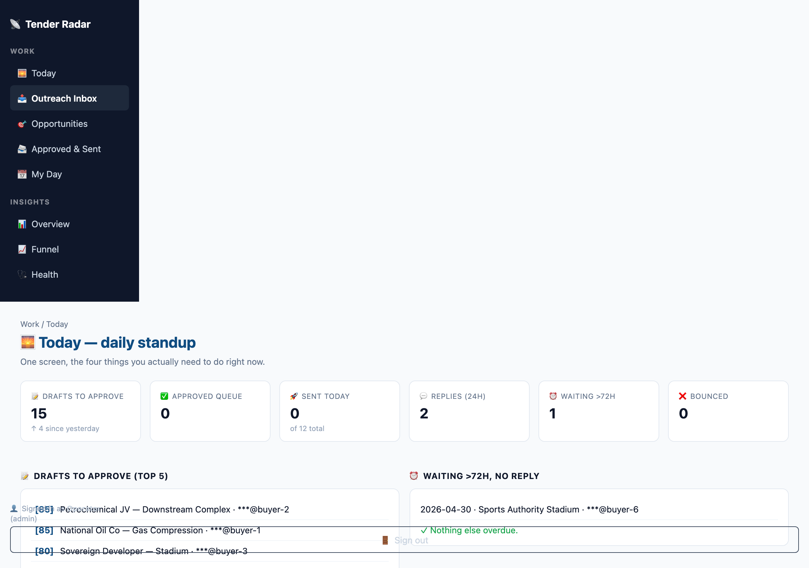
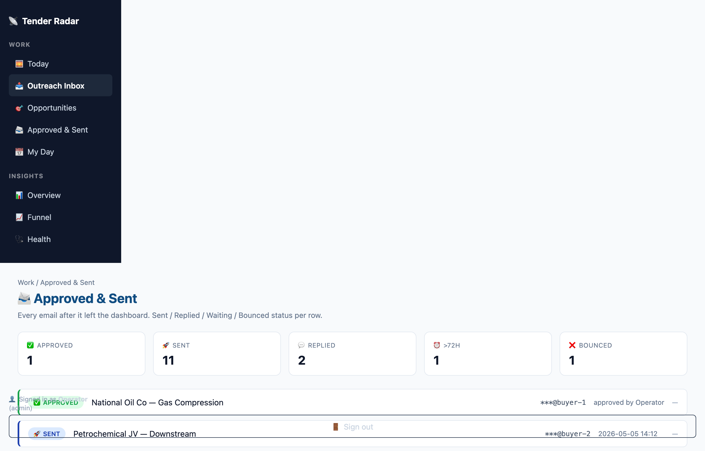
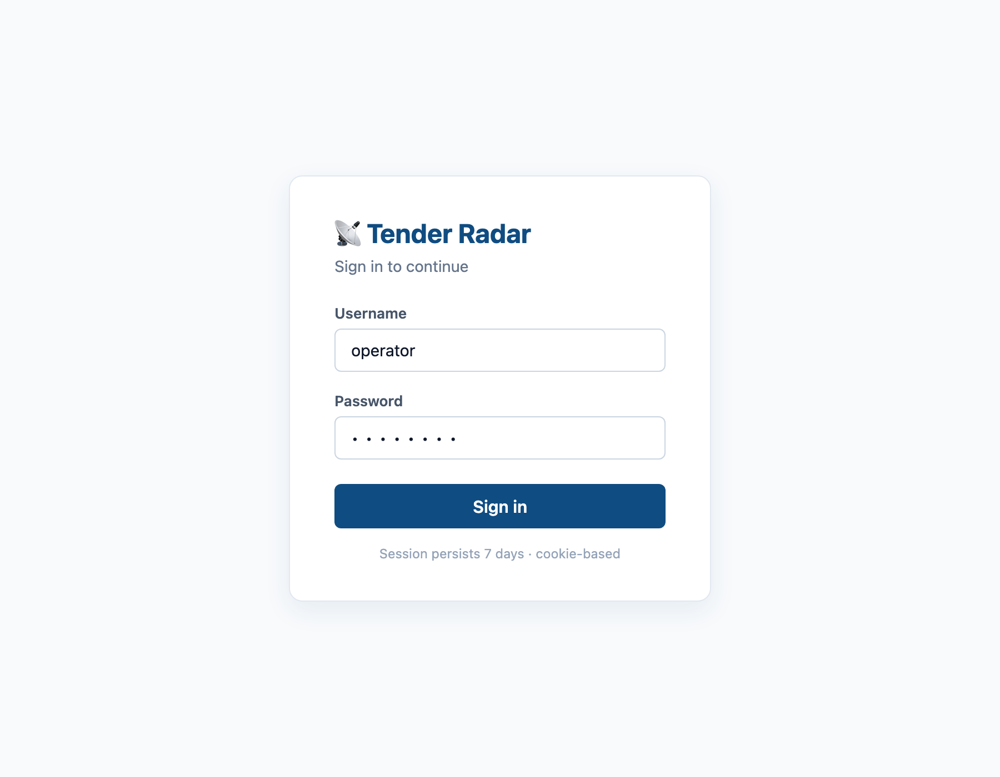

# Tender Outreach Pipeline

A pipeline that turns paid premium tender intelligence into approval-ready B2B outreach. Scrapes industry tender databases, scores opportunities for fit, finds named decision-makers off the source pages, drafts personalised emails, and queues them behind a manual approval gate. Replies are auto-classified and routed back to the right human.

This repository contains the architecture documentation and UI screenshots for the system. **Source code is private.**

---

## 1. What This System Does

A pipeline monitors a paid premium tender database that publishes ongoing industrial and infrastructure projects. Every three days it pulls every fresh project, scores it for relevance to the manufacturer it serves, finds the named procurement decision-makers on each project page, drafts a personalised outreach email, queues it behind a human approval gate, and sends it through the agent's mailbox once approved.

It also reads inbound replies, classifies them by intent (interested, RFQ, technical, decline, out-of-office, unsubscribe), drafts auto-responses for the sales person to approve, tracks bounces, and respects per-recipient throttle limits so the same person never gets more than two emails in seven days.

## 2. The Problem It Solves

The sales team spent half their week on the boring 80% of B2B tender outreach: opening tender database tabs, copying project data into spreadsheets, hunting for the right procurement person, writing intros, double-checking compliance details, sending, then forgetting to follow up.

Most leads cooled before the right person was reached. By the time a clean introduction with vendor codes landed in a buyer's inbox, the bid window had often closed.

This system does the boring 80% in minutes. The sales engineer just reviews, edits if needed, approves, and sends.

## 3. How the System Works (Step-by-Step)

**Input — every 3 days at 04:30 UTC.** A Playwright session logs into the premium tender database, walks every active country and sector search, and pulls project details, current status, milestones, and recent news updates. Saved cookies persist for the daily lightweight refresh.

**Processing per project:**

- gpt-4o-mini scores fit. Output: verdict (`go` / `maybe` / `skip`), fit score 0-100, sub-scores by region and sector, evidence quote.
- Project freshness check. Master plans with active sub-package bidding (≤180 days) force-fresh, even when the master contract was awarded years ago. Awarded-and-completed projects quietly drop out.
- Companies & Contacts block extracted via gpt-4o-mini given the raw HTML. Output: structured JSON of named people with role, company, email, phone.
- Local CSV (~30k regional contacts) checked as fallback when the source page has no named lead.
- Per-domain MX validation strips bouncing addresses upfront.
- Right-person check: contact's company / email-domain must overlap with one of the project's named parties.
- Role filter: drops HR, marketing, interns, accountants, anyone outside the buyer profile.
- AI brief generated per project (5 sections: the project, who decides, why it fits us, recent activity, suggested pitch angle).

**Decision per project:**

- Surviving contacts sorted by source priority: premium-listed > local CSV > role-inbox fallback.
- Pick best primary recipient plus 1-2 CC recipients from other project parties (so owner + contractor + consultant land in one email).
- Generate intro draft with project-specific opener, vendor codes, regional rep block, signature card.
- Local spam-score check on the body before queueing.
- Throttle check (skip if recipient hit the 2-per-week cap).

**Output — human in the loop:**

- Draft lands in the dashboard's Outreach Inbox with a trust badge, project brief, AI summary, and editable TO / CC / BCC.
- Sales person reviews, optionally types a free-form comment ("make this shorter", "remove the SASO line", "address the buyer more formally"). gpt-4o-mini rewrites the body in place.
- Approves → fires through the agent's mailbox via Microsoft Graph, BCC'd to the operator (always).
- Inbound replies polled daily, classified, forwarded to the operator and the regional engineer with intent tag.
- Bounces auto-disable the address; the picker stops queueing drafts to it.

## 4. System Design (High Level)

**Ingestion**

- Playwright headless Chromium with stealth flags for the 3-day heavy crawl.
- httpx with saved session cookies for daily lightweight refresh (avoids anti-bot).
- Manual paste-page-text UI in the dashboard for projects the bot can't reach.

**Processing**

- gpt-4o-mini for scoring, contact extraction, AI briefs, comment-driven rewrites, reply classification. One model end-to-end.
- Local Python regex and heuristics for project freshness, role-fit filtering, spam scoring.
- dnspython for MX validation; optional SMTP RCPT probe.

**Storage**

- SQLite, single file. Tables: opportunities, touches (drafts / sent / replies), email_log, runs, audit_log, suppress list, bounce list.
- Embeddings for the company-history retrieval layer pre-computed and stored as a numpy memmap.

**Output**

- Microsoft Graph API via msal client-credentials flow for sending.
- Per-message From-display-name override so the recipient sees the persona name regardless of the mailbox attribute.
- Application-access policy restricts the app to the persona's mailbox only.
- Streamlit dashboard with cookie-based session auth (7-day signed token), draft approval workflow, AI-comment rewrite, project drawer.

## 5. Key Decisions

**One model, end-to-end.** gpt-4o-mini does everything. No model-swapping. Per-opportunity spend lands at roughly $0.0007. Cost is not a constraint at any plausible scale.

**Premium-only outreach pool.** Public news / editorial sources land in the database for awareness but never produce drafts. Hidden by default. No spam to journalists.

**Premium-listed contact wins.** When the tender database explicitly names a procurement director on a project page, that record beats any third-party match. Even when the listed email is a personal address, source trust takes priority. The system bypasses the company-token and role filters for premium-sourced contacts.

**Manual approval gate.** Nothing fires without a human click, even when intent is clear. Every draft is approval-required. Auto-send categories are explicit and small (out-of-office acks).

**BCC the operator on every send.** Always. Not editable. Compliance and audit trail.

**Two-tier cron.** Heavy Playwright crawl every 3 days, light HTTP refresh daily. Anti-bot heat stays low because Playwright only touches the site once per cycle.

**Throttle is hard.** Same recipient, max 2 emails per 7 days, 14-day cooldown after a send. The picker tries the next-best contact at the same company before queueing a 3rd email to anyone.

## 6. What Went Wrong

- A regex-based contact parser produced false positives. Lines like `Red Sea Global, Saudi Arabia` matched a naive `Name, Title` regex. So did milestone labels like `Main Contract Completion, Commissioning` and sector strings like `Sport Facility, Stadium`. The dashboard ended up listing companies and table headings as if they were people.
- Anti-bot rejected mid-day login attempts. The scheduled 04:30 UTC crawl worked. Manual re-runs at midday got `Login submitted but still on login page`. Stealth flags helped a little but not reliably.
- Concurrent-session enforcement on the source. When the sales team was logged in via their own browser, the bot's login was refused as `username or password invalid`. Same credentials, same minute, just rejected because the seat was already in use. Took two hours to spot the pattern.
- Cookies-only HTTP fetch returned chrome, not content. The project pages render the Companies & Contacts block via JavaScript after page load. A direct HTTP GET with the saved cookies returned the page shell with zero project data. The bulk extraction silently produced empty contacts on the first run.
- Dry-run flipped status to `sent`. The send function had a single status-update path. After a sales person clicked Dry-run to validate, the status became `sent`, which made the real Send button disabled because it required `status='approved'`. The user reported the Send button was "blocked".
- Login refactor hid most drafts. Replaced PIN auth with username/password. Auto-populated a legacy `current_user` session field with the signed-in display name. That field doubled as the opportunity-owner filter for `pending_approval`. Suddenly admins saw only the drafts assigned to them, not all of them.
- Body editor cached old text after AI rewrite. Streamlit's text-area widget caches by `key`. After applying a comment-driven rewrite, the new body was saved to the database but the widget kept showing the user's previous edits. Required manual page refresh — looked broken.

## 7. How It Was Fixed

- Replaced the regex contact parser with gpt-4o-mini given the raw HTML of the Companies & Contacts section. The model handles multi-company sub-sections, single-word firm names, honorifics, diacritics, and rejects table noise. Zero false positives in the most recent run.
- Added a two-tier cron: heavy Playwright every 3 days (when anti-bot is least active), plus a daily HTTP refresh that uses the cookies the heavy run saved. Either failing falls through gracefully.
- Documented the concurrent-session quirk. When mid-day refresh is needed, the operator signs out of the source briefly. Otherwise the daily cron handles it.
- Built a manual paste-page-text UI in the dashboard. The sales person opens the project page in their authenticated browser, copies the text, pastes into the dashboard, gpt-4o-mini extracts contacts in one click. Bypasses the bot entirely for tricky pages.
- Split the send function's status logic. Dry-run keeps `status='approved'`. Real send moves to `'sent'`. Failure to `'failed'`. Sequential dry-run-then-send works.
- Added a `role` check in the dashboard. Admins call `pending_approval(owner=None)`, non-admins keep the owner filter. Both seats see all drafts now.
- Versioned the body widget's key (`oseq_body_<id>_v<n>`). The Apply Comment handler increments `n`, Streamlit treats it as a fresh widget on rerun, the new body shows in place. No manual refresh.

## 8. What I Would Improve Today

- Replace the password store with OIDC / Microsoft SSO. Two users today; that grows.
- Replace the third-party CSV with a paid email-enrichment provider that returns a `verified_email_status` field. The accuracy gap on guessed addresses is real.
- Add a Calendly-style booking link in every email so a positive reply converts to a meeting in one click instead of back-and-forth.
- Pipeline funnel KPIs: drafted → sent → replied → engineer-handoff → meeting → quote → won. Track per-template, per-region, per-buyer reply rates.
- Push every send into the company CRM as an activity (a stub exists, not yet active).
- Per-recipient warm-up channel: when the bot drafts an email, a parallel WhatsApp message draft goes to the regional rep so they can do a personal phone introduction first. Intent is not "adopt AI cold email", it's "AI does the research, human does the warm-up".
- A/B testing on subject lines and openers. Currently one template per step kind. With reply data this becomes a clean optimisation surface.
- Better staleness detection at sub-package level instead of master-plan only. A few master plans are still over-flagged.
- Today's spam-score check is local heuristics. Worth wiring a Mail-Tester run before the first batch of any new template.

## 9. Screenshots

*Drafts queued for approval. Each row shows the contact-source badge (premium-listed vs CSV), fit score, project name, and primary recipient. Expanding a row reveals Edit, Preview, and Project Brief tabs, plus the AI comment-rewrite box.*

*Per-project context. Top banner shows project liveness based on recent tender updates. Yellow "Why this fits" card extracts the AI brief's relevance section. Below: structured project facts, owner / contractor / consultant, premium-validated contacts with redacted emails and phones, recent updates from the source.*

*One-screen morning view. KPIs across the top (drafts pending, replies last 24h, sends overdue, bounced addresses). Below: split into top-5 drafts to approve, oldest unanswered sends, recent inbound replies, and system health.*

*Audit trail of every email after it left the dashboard. Status pills show ✓ Sent, 💬 Replied, ⏰ Waiting > 72h, ❌ Bounced. Expand any row for the full body, CC chain, BCC line (always locked to the operator), and reply summary if any.*

*Username + password gate with 7-day cookie persistence. Two roles: admin (full access) and rep (region-scoped, kept for future use).*

---

## Notes

- Source code is private.
- All names, emails, project titles in screenshots are fictional / redacted.
- Sanitised for public portfolio review.
